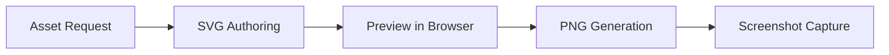

# wm-asset-workflows — Manifest and Spec Formats

## Asset Manifest (`manifests/assets.json`)

The manifest is the central catalog consumed by:
- The browser preview app (`preview/app.js`) to render logo tiles
- The PNG generator (`scripts/python/generate_images.py`) to produce output sheets

### Schema

```json
{
  "assets": [
    {
      "id": "asset-id",
      "label": "Human Readable Label",
      "source": "assets/svg/asset-id.svg",
      "variants": [
        { "size": 64, "theme": "light" },
        { "size": 64, "theme": "dark" },
        { "size": 128, "theme": "light" },
        { "size": 128, "theme": "dark" }
      ]
    }
  ]
}
```

### Field Reference

| Field | Type | Description |
|-------|------|-------------|
| `id` | string | Kebab-case identifier, must match the SVG filename (without extension) |
| `label` | string | Human-readable display name shown in preview tiles and PNG sheets |
| `source` | string | Relative path to the SVG file from the repo root |
| `variants` | array | List of output variant descriptors |
| `variants[].size` | number | Output dimension in px (square) |
| `variants[].theme` | string | `"light"` or `"dark"` — controls background treatment in PNG output |

### Naming Conventions

- Asset IDs must be kebab-case (e.g. `wm-spark`, `brand-mark`, `icon-settings`)
- `source` paths must start with `assets/svg/` — never point outside the `assets/` directory
- Add all intended sizes/themes as separate variant objects

### Example

```json
{
  "assets": [
    {
      "id": "wm-spark",
      "label": "WM Spark",
      "source": "assets/svg/wm-spark.svg",
      "variants": [
        { "size": 64, "theme": "light" },
        { "size": 64, "theme": "dark" },
        { "size": 128, "theme": "light" },
        { "size": 128, "theme": "dark" }
      ]
    }
  ]
}
```

---

## Mermaid Diagram Specs (`specs/*.md`)

Spec files are plain markdown with Mermaid fenced code blocks. The `build-spec-index.mjs` script extracts all Mermaid blocks and writes them to `preview/spec-index.json` for display in the browser preview's Diagram Specs panel.

### Format

```markdown
# Spec File Title

Optional prose description.



Additional sections and multiple Mermaid blocks are supported in one file.
```

### Rules

- Any `.md` file in `specs/` is scanned for Mermaid blocks
- The first `# Heading` in each file is used as the spec group title in the preview
- Multiple Mermaid blocks per file are extracted as separate diagram tiles
- Mermaid is for flows and architecture diagrams — not for constructing brand marks or logos

### Rebuild After Changes

```bash
npm run build:specs
```

This regenerates `preview/spec-index.json`. The file is git-ignored; always rebuild before previewing.
